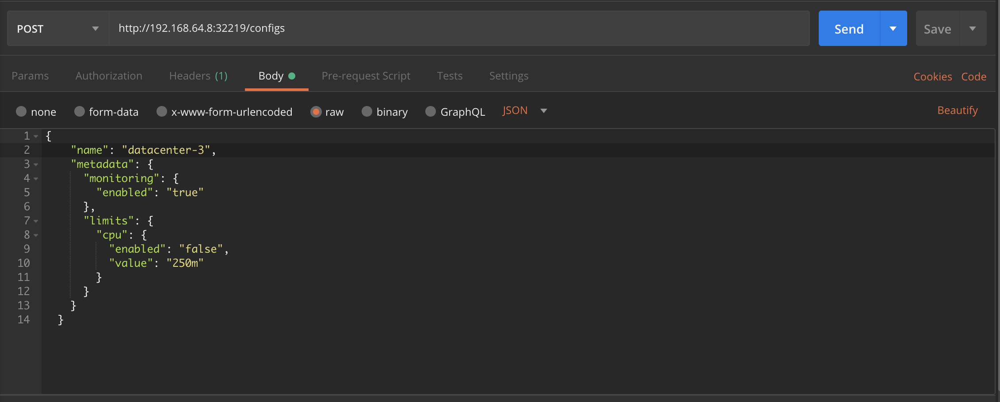
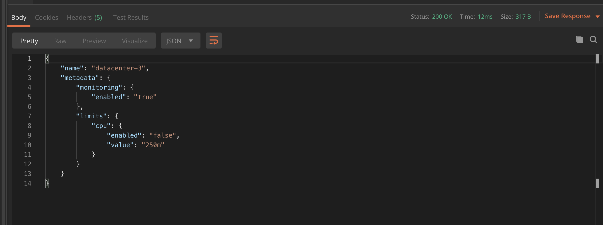
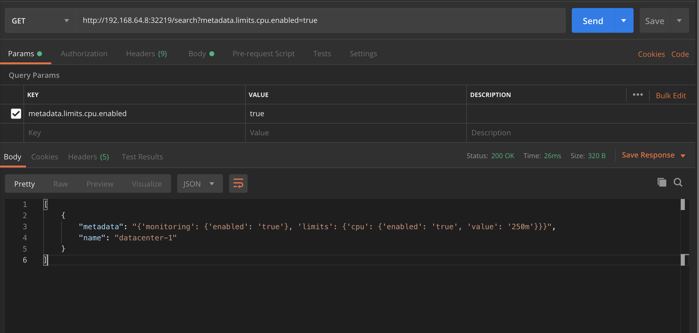

# configsAPI-K8S
Deploying stateless Python Flask app with Redis on Kubernetes

----

*Configs API* is a simple HTTP service that stores and returns configurations that satisfy certain conditions.
This document shows you how to develop, deploy and run the Configs API on Kubernetes with Python Flask, Redis, YAML, Bash
Docker and Minikube.

The service is automatically deployed to kubernetes with Bash scripts.
> 💡 The deployment varaiables are rendered to the yamls files using the `envsubst` magic

----

## Introduction
This README walks you through the process of running the Configs API on a Kubernetes cluster.
This solution allows you to automate the deploymen and management of the application containers.

The first step is to obtain the application source code and Dockerfile.
and use them as a starting point for creating a custom yaml manifests to automate the application deployment in a Kubernetes cluster.

## Assumption And Prerequisites

- You have basic knowledge of how to build Docker images.
- You have basic knowledge of yaml manfifests and how to create them.
- You have basic knowledge of bash and shell.
- You have a Docker environment running.
- You have an account in a container registry (this project assumes that you are using Docker Hub).
- You have Minikube installed in your local computer.
- You have the kubectl command line (kubectl CLI) installed.
- You have Python and Redis installed on your machine for testing


## Steps:
To create Configs  application and deploy it on Kubernetes, you will typically follow these steps:

1.  Obtain the source code
2.  Build the Docker image
3.  Publish the Docker image
4.  Deploy the application in Kubernetes
5.  Test the Configs API

## Obtain the source code

Clone the repository. This will clone the sample repository and make it the current directory:

* `$ git `

* `$ cd configsAPI-K8S`


## Project layout

The directory that holds the app source code and configuration files for this lab has a special tree structure. Obviously, there are 4 main subfolders: deployment, scripts, src and 


. In order to see the source code structure you can run `tree`

````
|~/run-it-on-cloud/configsAPI-K8S 💻 --⑆ dev 🔧
|
|--⫸ tree
.
├── Documentation.md
├── README.md
├── deployment
│   ├── app-deployment.yaml
│   ├── app-service.yaml
│   └── redis.yaml
├── scripts
│   ├── env-for-local-dev.sh
│   └── render-deployment-files.sh
├── src
│   ├── Dockerfile
│   ├── main.py
│   └── requirements.txt
└── test
    └── test.py
````

## Project structure

1. `/src`: holds the source code, requirements  and the Dockerfile
   - `main.py`: the Python Flask code that manage the HTTP services
   - `Dockerfile`: the Dockerfile config that create the main docker image
   - `requirements.txt`: holds all the required pckages to run the Python code

2. `/deployment `: holds the yaml manifest Kubernetes deployment
   - `app-deployment.yaml`: contain the yaml configs to deploy the Configs flask api based on the docker image created in // `/src`
   - `app-service.yaml`: config the Configs API service in Kubernetes
   - `redis.yaml`: deploy redis service the K8S cluster

3. `scripts`: holds the automation scripts
   - `env-for-local-dev.sh`: export the environment and the deployments variables
   - `render-deployment-files.sh`: set variabels, render the yaml files and run the `kubectl apply ./deployment`

4. `test`: holds the application unit tests


## Configs API
*Configs API* is a simple HTTP service that stores and returns configurations that satisfy certain conditions.

#### Endpoints

The application serve following endpoint structure and return the HTTP status codes appropriate to each operation.

Following are the endpoints that should be implemented:

| Name   | Method      | URL
| ---    | ---         | ---
| List   | `GET`       | `/configs`
| Create | `POST`      | `/configs`
| Get    | `GET`       | `/configs/{name}`
| Update | `PUT/PATCH` | `/configs/{name}`
| Delete | `DELETE`    | `/configs/{name}`
| Query  | `GET`       | `/search?metadata.key=value`


##### Query Example

The query endpoint return all configs that satisfy the query argument.

Query example-1:

```sh
curl http://config-service/search?metadata.monitoring.enabled=true
```

Response example:

```json
[
  {
    "name": "datacenter-1",
    "metadata": {
      "monitoring": {
        "enabled": "true"
      },
      "limits": {
        "cpu": {
          "enabled": "false",
          "value": "300m"
        }
      }
    }
  },
  {
    "name": "datacenter-2",
    "metadata": {
      "monitoring": {
        "enabled": "true"
      },
      "limits": {
        "cpu": {
          "enabled": "true",
          "value": "250m"
        }
      }
    }
  },
]
```
##### Schema

- **Config**
  - Name (string)
  - Metadata (nested key:value pairs where both key and value are strings of arbitrary length)

#### Configuration

`Configs API` serve the API on the port defined by the environment variable `SERVE_PORT`.

## Configs API Unit Test

#### Test Scenario

We have an example unit test for our Configs API in the `/ test` folder, the unit test is based on the following scenario:

1.  `GET`      `http://config-service/`: to make sure that the API is operational
2.  `POST`     `http://config-service/configs`: create 2 examples of configs
3.  `GET`      `http://config-service/configs`: the script will retrieve all the configs from the redis database as a valid json, list of dicts containing the configurations created
4.  `GET`      `http://config-service/configs/datacenter-x`: read a configuration designed by its name
5.  `GET`      `http://config-service/search?metadata.limits.cpu.enabled=false`: execute the query search which returns all the configurations that satisfy the argument of the query
6.  `DELETE`   `http://config-service/configs/datacenter-x` delete one of the configurations already created
7.  `PATCH`    `http://config-service/configs/datacenter-x`  The test script will finally patch the name of the remaining configuration


#### Run the unit test

* In this API test, I used `unittest` as the unit testing framework
* This also Assuming that you have a running Redis server in your machine.


`$ redis-server& # start the redis server`

`$ pip install -r src/requirements.txt`

`$ python3 test/test.py`

The result of the test is as follows:

````
|--⫸ python3 test/test.py
..
----------------------------------------------------------------------
Ran 2 tests in 0.025s

OK

|--⫸ coverage report test/test.py
Name           Stmts   Miss  Cover
----------------------------------------------------------------------
test/test.py      48     12    75%

````


## Build The Docker Image

The source code already contains the Dockerfile needed for the Configs API.

Build the image using the command below:

* `$ cd src && docker build -t flas-redis-basic-api .`

## Publish The Docker Image

To upload the image to Docker Hub Repository (already exists!), follow the steps below:

* Log in to Docker Hub: `$ docker login`
* Tag and Push the image to your Docker Hub account. (you can replace the username placeholder with your Docker ID:

`$ docker tag flas-redis-basic-api:latest  aymensegni/flask-redis-api:dev`

`$ docker push aymensegni/flask-redis-api:dev`

## Deploy The Configs API Application In Kubernetes


`$ ./scripts/env-for-local-dev.sh # set the SERVE_PORT variable`

`$ ./scripts/render-deployment-files.sh # Render the manifest files and run the deployment `

## Verify the Deployment

To verify the API deployment, you can run the following `kubectl cli`

* Verify running pods

````
|--⫸ kubectl  get pods
NAME                                          READY   STATUS    RESTARTS   AGE
flask-redis-api-deployment-55d9d6d4bc-7lcpn   1/1     Running   0          149m
redis-master-7b8487bf68-6fkv4                 1/1     Running   0          165m

````

* Verify the deployments:
````
|--⫸ kubectl get deployments
NAME                         READY   UP-TO-DATE   AVAILABLE   AGE
flask-redis-api-deployment   1/1     1            1           4h20m
redis-master                 1/1     1            1           167m
````
* Get the services list:

````
|--⫸ minikube service list
|-------------|-------------------------|---------------------------|-----|
|  NAMESPACE  |          NAME           |        TARGET PORT        | URL |
|-------------|-------------------------|---------------------------|-----|
| default     | flask-redis-api-service | http://192.168.64.8:32219 |
| default     | kubernetes              | No node port              |
| default     | redis-master            | No node port              |
| kube-system | kube-dns                | No node port              |
|-------------|-------------------------|---------------------------|-----|
````


## Get the application URL

In Minikube, we can check the application service to get the application’s URL:

`$ minikube service flask-redis-api-service --url`

##### example:
|--⫸ minikube service flask-redis-api-service --url
http://192.168.64.8:32219

# Explore the application (Optional)

Copy the **application url** from the last command output. then, using this value open `Postman`for local testing

Finally, we can write and read the configs data from the Redis database.

1. Create new config:




2. List all configs


3. Get config by name


4. Query configs




----

**Congratulations! our Configs application has been successfully deployed on Kubernetes!**


